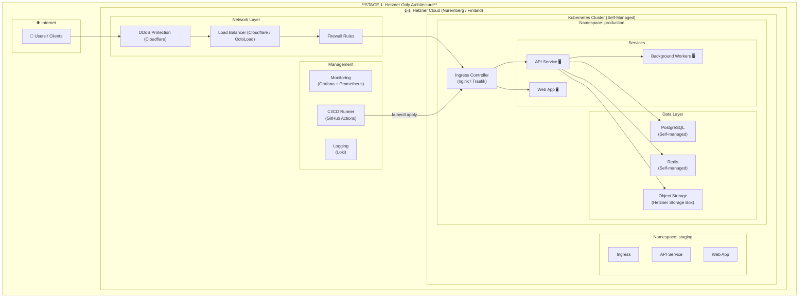
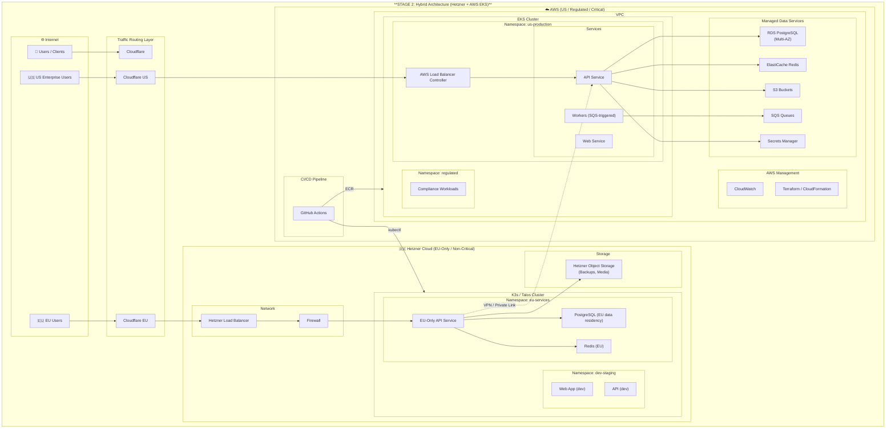
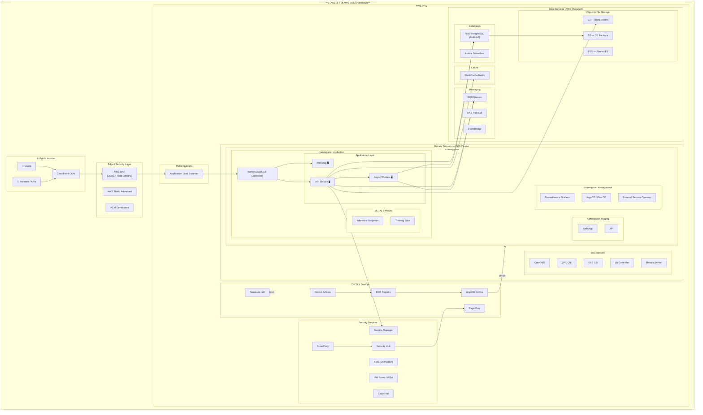
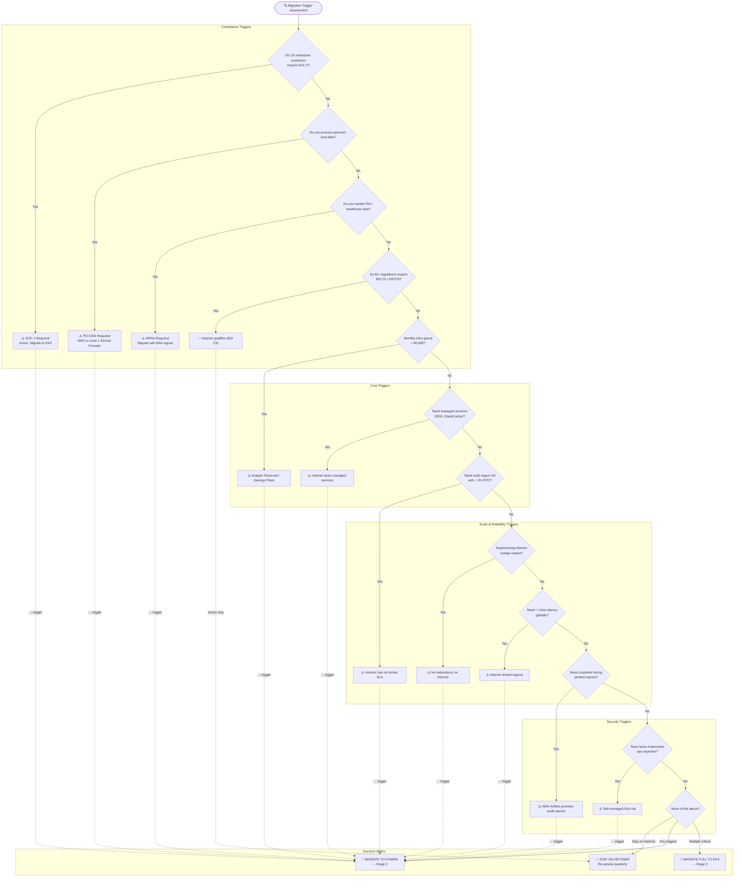
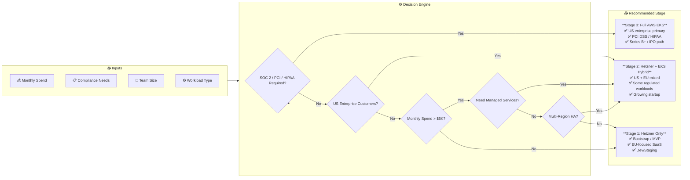
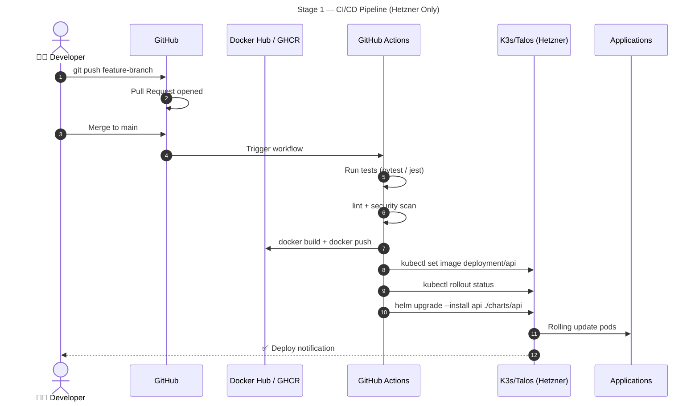
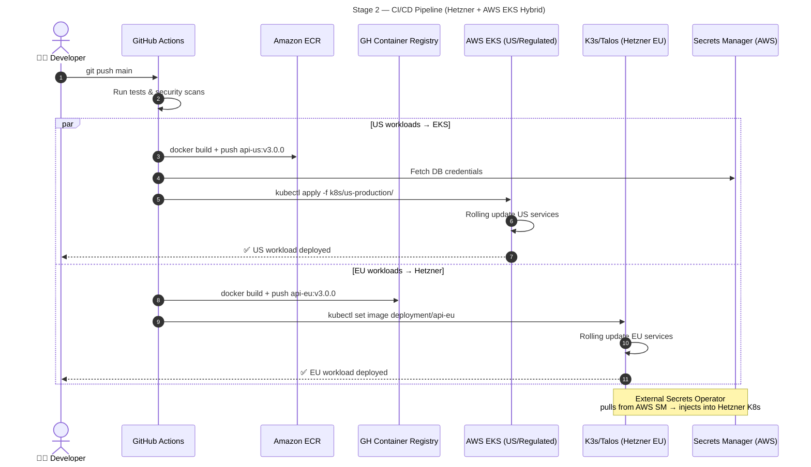
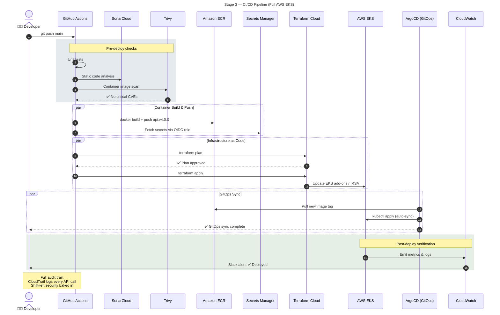

# Startup Migration: Hetzner → AWS EKS

A decision framework and architecture documentation for startups evaluating infrastructure migration from Hetzner Cloud to AWS EKS.

---

## Overview

This guide documents the typical journey of a startup migrating from **Hetzner Cloud** (self-managed Kubernetes) to **AWS EKS** (managed Kubernetes).

### 3-Stage Progression

| Stage | Platform | Monthly Spend | Team Size | Use Case |
|---|---|---|---|---|
| **Stage 1** | Hetzner Only | €20–100 | 1–5 | MVP, EU-focused, Bootstrap |
| **Stage 2** | Hetzner + AWS Hybrid | €100–500 + $500–2K | 5–15 | US + EU mixed customers |
| **Stage 3** | Full AWS EKS | $2K–20K | 15+ | US enterprise, Series B+ |

---

## Migration Journey

```mermaid
flowchart TD
    START([🚀 Startup Founded]) --> FUNDING

    FUNDING{"Funding Stage?"}
    FUNDING -->|Bootstrapped / Pre-Seed| EVAL_HETZNER
    FUNDING -->|Seed / Series A| EVAL_HETZNER

    subgraph STAGE_1["**STAGE 1: Hetzner Foundation**"]
        EVAL_HETZNER{["Is Hetzner sufficient?"]}
        EVAL_HETZNER -->|Yes| DEPLOY_HETZNER
        EVAL_HETZNER -->|No| ESCALATE_EKS

        DEPLOY_HETZNER["Deploy on Hetzner Cloud"]
        DEPLOY_HETZNER --> K8S_HETZNER["Self-managed Kubernetes<br/>(RKE2 / Talos / K3s)"]
        K8S_HETZNER --> GROW_HETZNER["Iterate & Grow on Hetzner"]
        GROW_HETZNER --> MONITOR_TRIGGERS

        MONITOR_TRIGGERS{"Monitoring Triggers..."}
        MONITOR_TRIGGERS -->|"US Enterprise Deals"| ESCALATE_EKS
        MONITOR_TRIGGERS -->|"SOC 2 Required"| ESCALATE_EKS
        MONITOR_TRIGGERS -->|"HIPAA / PCI DSS"| ESCALATE_EKS
        MONITOR_TRIGGERS -->|"$5K+/mo infra spend"| COST_REVIEW
        MONITOR_TRIGGERS -->|"Multi-region SLA needed"| ESCALATE_EKS
        MONITOR_TRIGGERS -->|"No triggers"| STAY_HETZNER["✅ No triggers — stay on Hetzner"]
    end

    subgraph STAGE_2["**STAGE 2: Hetzner + AWS Hybrid**"]
        ESCALATE_EKS["Identify EKS-ready workloads"]
        ESCALATE_EKS --> SEGREGATE["Segregate workloads"]
        
        SEGREGATE --> WHICH_MIGRATE{"Which to migrate first?"}
        WHICH_MIGRATE -->|"Customer-facing APIs"| PRIORITY_1["1. Customer-facing services"]
        WHICH_MIGRATE -->|"US customer workloads"| PRIORITY_2["2. Regulated workloads"]
        WHICH_MIGRATE -->|"Critical path services"| PRIORITY_3["3. High-availability services"]

        PRIORITY_1 --> SETUP_EKS["Provision EKS Cluster"]
        PRIORITY_2 --> SETUP_EKS
        PRIORITY_3 --> SETUP_EKS
        SETUP_EKS --> CI_CD_EKS["Setup CI/CD to EKS"]
        CI_CD_EKS --> MIGRATE_FIRST["Migrate first workload"]
        MIGRATE_FIRST --> VERIFY["Verify in production"]
        VERIFY --> STABLE{["Is it stable?"]}
        STABLE -->|Yes| HETZNER_STAYS["Keep Hetzner for:<br/>- Dev/Staging<br/>- Non-critical workloads<br/>- EU-only services"]
        STABLE -->|No| ROLLBACK["Rollback to Hetzner"]
        ROLLBACK --> FIX(["Fix issues, retry"])
        FIX --> MIGRATE_FIRST
        HETZNER_STAYS --> ITERATE_MIGRATION["Iterate: migrate next workload"]
        ITERATE_MIGRATION --> MORE{"More workloads?"}
        MORE -->|Yes| WHICH_MIGRATE
        MORE -->|No| HYBRID_STABLE["✅ Stable Hybrid State"]
    end

    subgraph STAGE_3["**STAGE 3: Full EKS (or Multi-Cloud)**"]
        HYBRID_STABLE --> DECIDE_FUTURE{"Long-term strategy?"}
        DECIDE_FUTURE -->|"Primary: US Enterprise"| FULL_EKS["Migrate remaining workloads to EKS"]
        DECIDE_FUTURE -->|"Cost optimization"| MULTI["Hetzner + EKS + Spot"]
        DECIDE_FUTURE -->|"EU Sovereignty"| EU_FOCUS["Scale Hetzner, use EKS-EU"]

        FULL_EKS --> FINAL_EKS["✅ Full AWS EKS Platform"]
        MULTI --> FINAL_MULTI["✅ Multi-Cloud Strategy"]
        EU_FOCUS --> FINAL_EU["✅ EU-First with AWS EKS-EU"]
    end
```

---

## Architecture Diagrams

### Stage 1 — Hetzner Only



### Stage 2 — Hybrid (Hetzner + EKS)



### Stage 3 — Full AWS EKS



---

## Migration Trigger Decision Flowchart



---

## Quick Decision Matrix



---

## Journey Timeline


---

## CI/CD Pipeline Evolution

### Stage 1 — Hetzner Only



### Stage 2 — Hybrid



### Stage 3 — Full EKS



---

## Cost Comparison

### Hetzner vs AWS EKS

| Configuration | Hetzner | AWS EKS | Delta |
|---|---|---|---|
| 2 vCPU / 4GB RAM | €5.99/mo | ~$48 (€44) | **7x** |
| 4 vCPU / 8GB RAM | €11.99/mo | ~$96 (€88) | **7x** |
| 8 vCPU / 16GB RAM | €22.99/mo | ~$192 (€176) | **7.5x** |
| 16 vCPU / 32GB RAM | €43.99/mo | ~$384 (€352) | **8x** |
| 32 vCPU / 64GB RAM | €83.99/mo | ~$768 (€704) | **8.5x** |

### Annual Savings (Hetzner vs EKS at ~$800/mo AWS)

- **Monthly Delta**: ~€640
- **Annual Savings**: ~€7,680

### Hidden Cost Comparison

| Factor | Hetzner | AWS EKS |
|---|---|---|
| Server cost | ✅ Fixed | ❌ + EKS cluster (~$73/mo fixed) |
| DDoS protection | ✅ Free | ❌ Shield Advanced ($3K+/mo) |
| Egress costs | ✅ 20TB included (EU) | ❌ ~$90/TB |
| Managed K8s | ❌ Self-managed | ✅ Managed control plane |
| Managed DB/Cache | ❌ None | ✅ RDS, ElastiCache |
| Compliance certs | ❌ ISO 27001, BSI C5 only | ✅ SOC 2, PCI DSS, HIPAA, FedRAMP |
| Engineer ops time | ❌ Higher | ✅ Lower |

### When does EKS ROI make sense?

- 💰 Enterprise contract value **> €10K/mo**
- 💰 Time saved on ops **> 20hrs/mo**
- 💰 Compliance blocks **> €50K revenue**
- 💰 Managed DB replaces **1 engineer**

---

## Compliance Comparison

| Certification | Hetzner | AWS EKS |
|---|---|---|
| ISO 27001:2022 | ✅ | ✅ |
| BSI C5 Type 2 | ✅ | ✅ |
| SOC 2 | ❌ | ✅ |
| PCI DSS Level 1 | ❌ | ✅ |
| HIPAA BAA | ❌ | ✅ |
| FedRAMP | ❌ | ✅ |
| GDPR / EU Data Residency | ✅ | ✅ (Sovereign Cloud) |

---

## License

MIT
