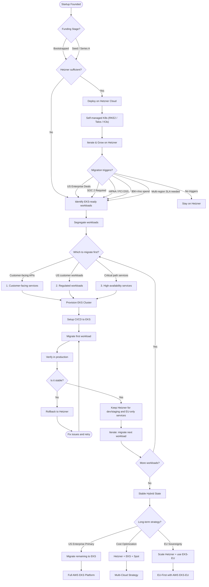
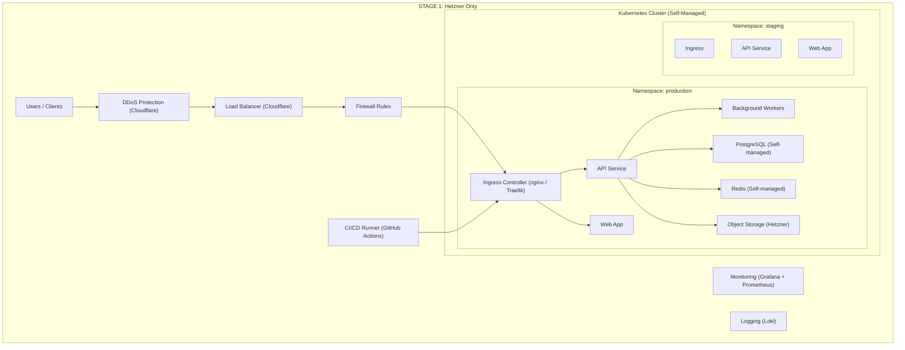
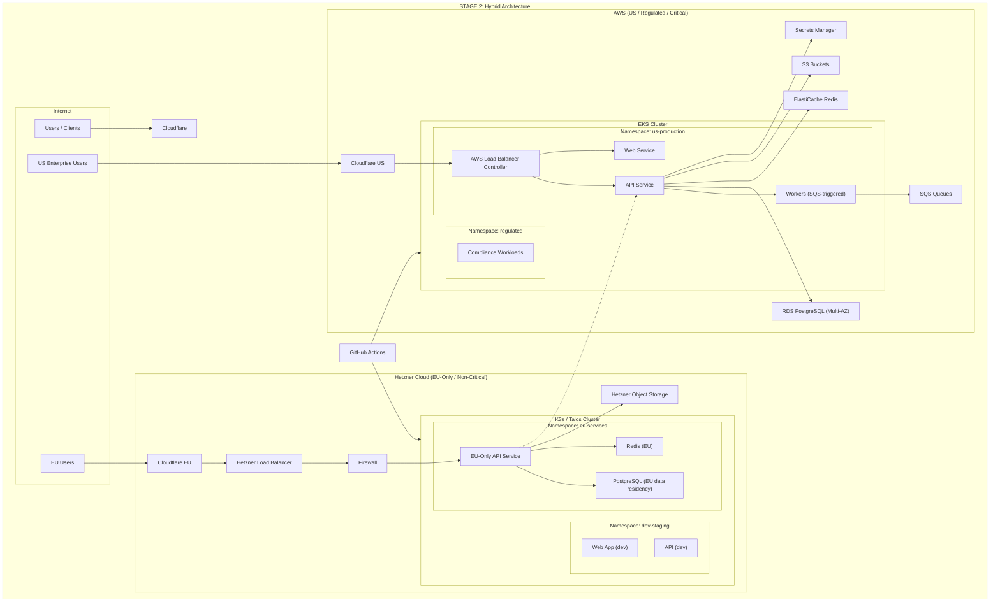
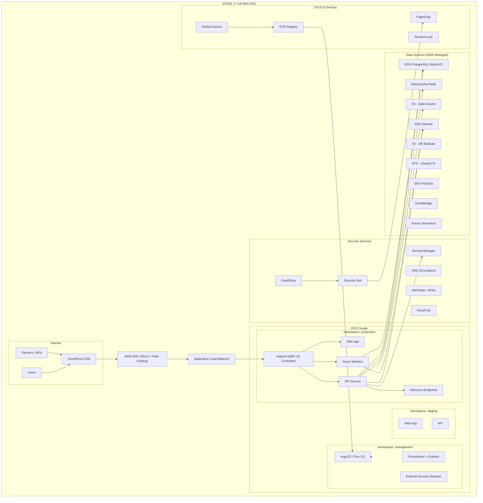
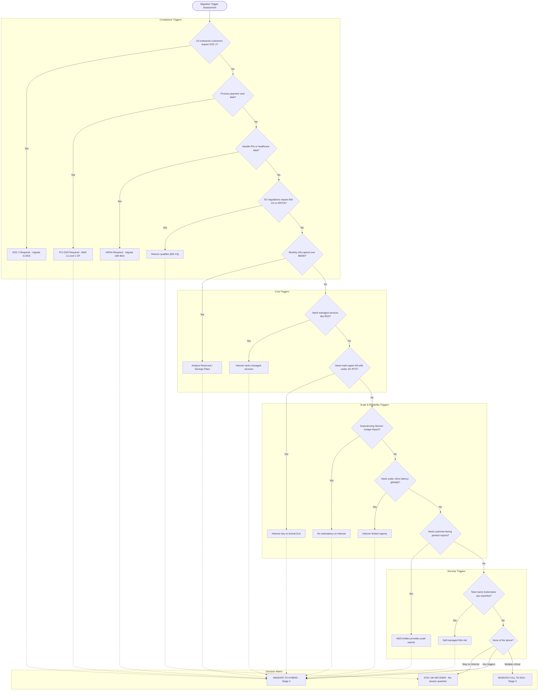
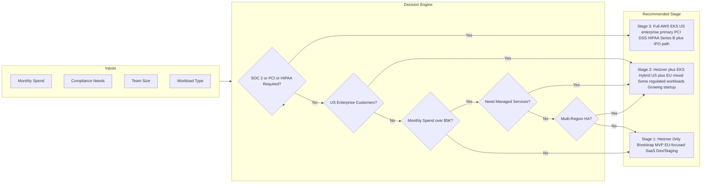
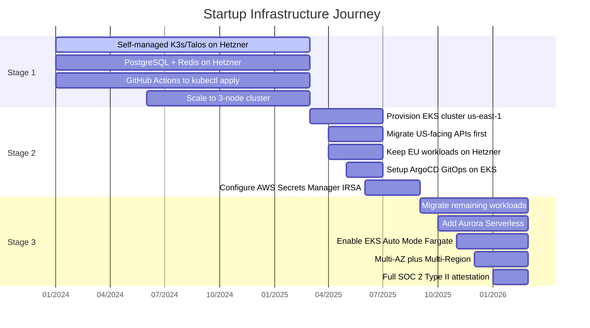
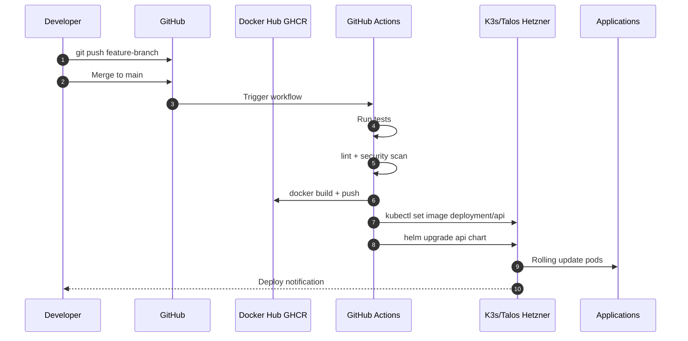
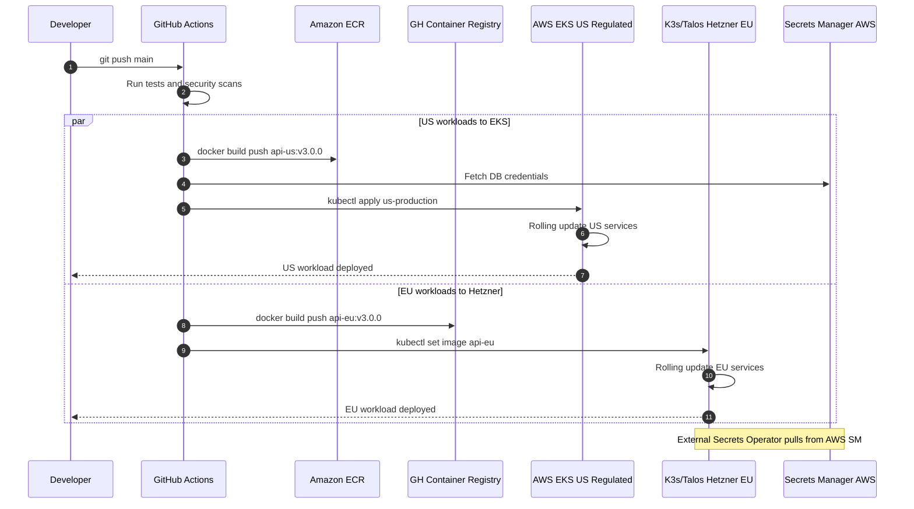
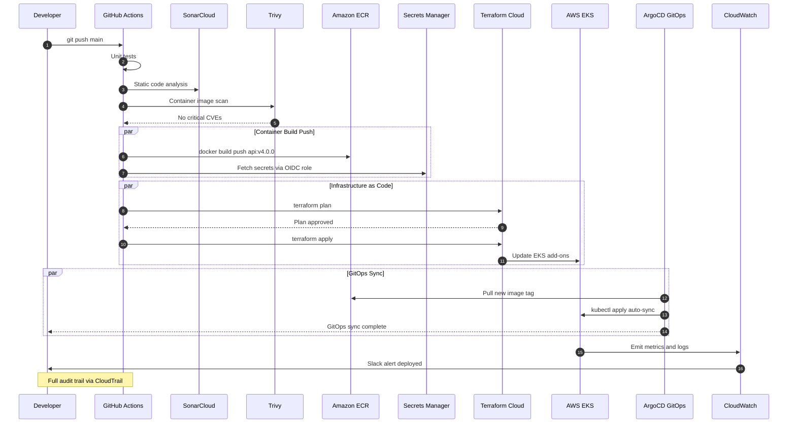

# Startup Migration: Hetzner to AWS EKS

A decision framework and architecture documentation for startups evaluating infrastructure migration from Hetzner Cloud to AWS EKS.

---

## Overview

This guide documents the typical journey of a startup migrating from **Hetzner Cloud** (self-managed Kubernetes) to **AWS EKS** (managed Kubernetes).

### 3-Stage Progression

| Stage | Platform | Monthly Spend | Team Size | Use Case |
|---|---|---|---|---|
| **Stage 1** | Hetzner Only | €20–100 | 1–5 | MVP, EU-focused, Bootstrap |
| **Stage 2** | Hetzner + AWS Hybrid | €100–500 + $500–2K | 5–15 | US + EU mixed customers |
| **Stage 3** | Full AWS EKS | $2K–20K | 15+ | US enterprise, Series B+ |

---

## Migration Journey

---

## Architecture Diagrams

### Stage 1 — Hetzner Only

### Stage 2 — Hybrid (Hetzner + EKS)

### Stage 3 — Full AWS EKS

---

## Migration Trigger Decision Flowchart

---

## Quick Decision Matrix

---

## Journey Timeline

---

## CI/CD Pipeline Evolution

### Stage 1 — Hetzner Only

### Stage 2 — Hybrid

### Stage 3 — Full EKS

---

## Cost Comparison

### Hetzner vs AWS EKS

| Configuration | Hetzner | AWS EKS | Delta |
|---|---|---|---|
| 2 vCPU / 4GB RAM | €5.99/mo | ~$48 (€44) | **7x** |
| 4 vCPU / 8GB RAM | €11.99/mo | ~$96 (€88) | **7x** |
| 8 vCPU / 16GB RAM | €22.99/mo | ~$192 (€176) | **7.5x** |
| 16 vCPU / 32GB RAM | €43.99/mo | ~$384 (€352) | **8x** |
| 32 vCPU / 64GB RAM | €83.99/mo | ~$768 (€704) | **8.5x** |

### Annual Savings

- **Monthly Delta**: ~€640
- **Annual Savings on Hetzner**: ~€7,680

### Hidden Cost Comparison

| Factor | Hetzner | AWS EKS |
|---|---|---|
| Server cost | Fixed | Plus EKS cluster (~$73/mo fixed) |
| DDoS protection | Free | Shield Advanced (additional cost) |
| Egress costs | 20TB included (EU) | ~$90/TB |
| Managed K8s | Self-managed | Managed control plane |
| Managed DB/Cache | None | RDS, ElastiCache |
| Compliance certs | ISO 27001, BSI C5 only | SOC 2, PCI DSS, HIPAA, FedRAMP |
| Engineer ops time | Higher | Lower |

### When does EKS ROI make sense?

- Enterprise contract value **over €10K/mo**
- Time saved on ops **over 20hrs/mo**
- Compliance blocks **over €50K revenue**
- Managed DB replaces **1 engineer**

---

## Compliance Comparison

| Certification | Hetzner | AWS EKS |
|---|---|---|
| ISO 27001:2022 | Yes | Yes |
| BSI C5 Type 2 | Yes | Yes |
| SOC 2 | No | Yes |
| PCI DSS Level 1 | No | Yes |
| HIPAA BAA | No | Yes |
| FedRAMP | No | Yes |
| GDPR / EU Data Residency | Yes | Yes (Sovereign Cloud) |

---

## License

MIT
